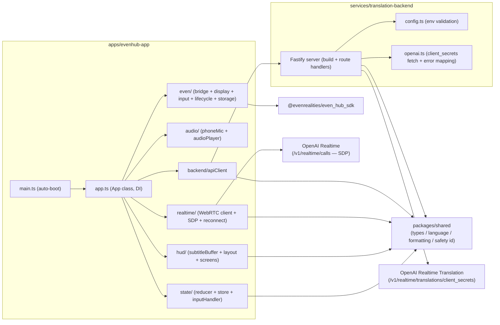
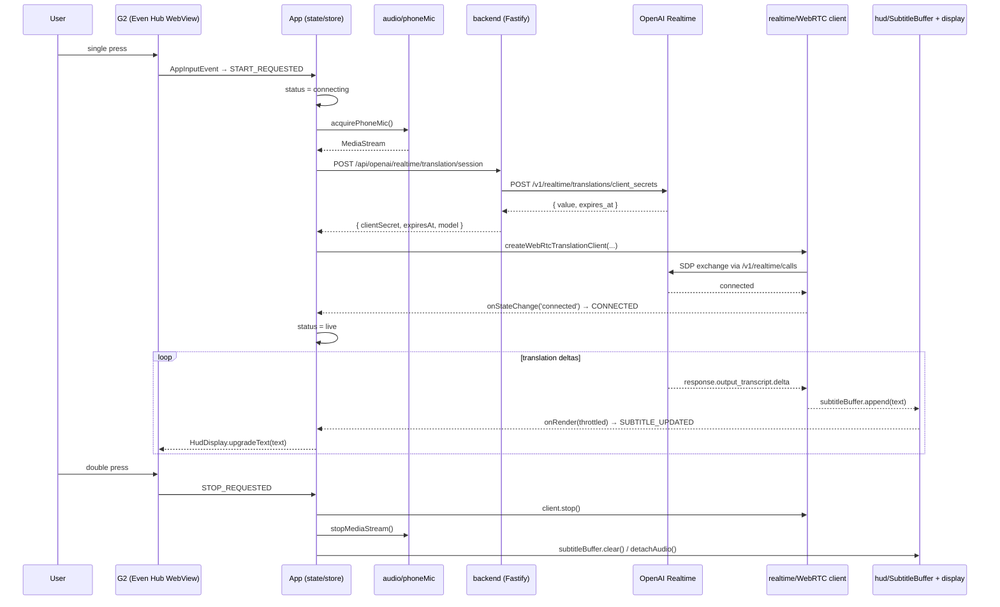

# Architecture Overview

PoC のモジュール依存とレイヤ責務をまとめたもの。実装の詳細は設計書
[`docs/realtime-translation-eveng2-mvp-design.md`](./realtime-translation-eveng2-mvp-design.md) を参照。

---

## 1. リポジトリ構成

```
apps/
  evenhub-app/             # Even Hub WebView アプリ (Vite + TypeScript + Even SDK)
services/
  translation-backend/     # Fastify backend: OpenAI client secret 発行 / CORS / rate limit
packages/
  shared/                  # 共有型 / 言語定義 / formatting utilities
docs/
  realtime-translation-eveng2-mvp-design.md  # 元設計
  test-plan.md
  dev-setup.md
  architecture.md          # 本ファイル
```

---

## 2. モジュール依存図



---

## 3. レイヤ責務

### 3.1 `packages/shared`

| Module | Responsibility |
| --- | --- |
| `types/state.ts` | `AppStatus`, `ConnectionStatus`, `LanguageCode`, `LanguagePair` |
| `types/translation.ts` | Realtime server event 型 / `SubtitleSegment` |
| `types/api.ts` | backend API の request / response / error |
| `language.ts` | サポート言語列挙 / `nextTargetLanguage` ローテーション |
| `formatting/lineBreak.ts` | 文字幅計算 / 24 列折返し / `truncate` |
| `formatting/segmentBoundary.ts` | 句点・改行・最大文字数による境界検出 |
| `formatting/safetyIdentifier.ts` | `OpenAI-Safety-Identifier` 用 SHA-256 ハッシュ |

依存はゼロ（標準 `node:crypto` のみ）。app / backend どちらからも参照される。

### 3.2 `services/translation-backend`

Phase 1 では OpenAI への bearer 認証を WebView に渡さないために存在する（§10.1）。

| Module | Responsibility |
| --- | --- |
| `config.ts` | env validation。必須キー欠落で起動を止める |
| `openai.ts` | `requestClientSecret`（POST `/v1/realtime/translations/client_secrets`）と `mapUpstreamError` |
| `server.ts` | `buildServer` で Fastify インスタンスを生成。CORS / rate limit / `/health` / `/api/openai/realtime/translation/session` / `/api/events` |
| `index.ts` | `dotenv.config()` + `buildServer().listen()` |

応答は最低限。upstream エラーは `auth_error` / `rate_limited` / `upstream_error` の 3 つに正規化し、生メッセージは伝播しない（§10.2）。

### 3.3 `apps/evenhub-app`

Even Hub の WebView 内で動く。設計書 §15 の boot シーケンスを `App` クラスにまとめている。

| Layer | Responsibility |
| --- | --- |
| `even/` | Even Hub SDK のラッパー。bridge handshake / textContainerUpgrade throttle / lifecycle / input / storage / mock bridge |
| `audio/` | `getUserMedia({ audio: true })` 取得 / track 停止 / remote audio 再生 |
| `backend/apiClient.ts` | backend の `/api/openai/realtime/translation/session` を叩く。エラーは `TranslationApiError` に正規化 |
| `realtime/` | OpenAI Realtime WebRTC client。SDP 交換 / data channel 受信 / event parse / reconnect backoff |
| `hud/` | subtitleBuffer（throttle + 境界検出）/ layout（status bar / 折返し）/ screens（status ごとのテンプレート） |
| `state/` | reducer（pure）/ minimal store / inputHandler（G2 ボタン → action） |
| `app.ts` | 上記全部を DI で受け取り、boot / start / stop / dispose のライフサイクルを所有する |
| `config.ts` | `import.meta.env` から `PUBLIC_*` を読み出す |
| `main.ts` | プロダクション entry。`loadAppConfig()` → `new App()` → `boot()` |

---

## 4. データフロー（live セッション中）



---

## 5. 設計上の不変条件

- **OpenAI API key は backend のみ**（§10.1）。WebView は短命 client secret しか持たない
- **transcript / audio はログに残さない**（§10.2）。Fastify ロガーは redact 設定で `req.body.userId` などを抹消
- **bridge layer は SDK の薄いラッパー**。プロダクションコードは `App` を経由してしか SDK を呼ばない
- **reducer は pure**。I/O は `App.onStatusChange` が引き受ける
- **subtitleBuffer は throttle を 150ms 既定**。HUD の textContainerUpgrade も 150ms throttle で重ね、二段の rate limit にする（§11.3）

---

## 6. 参照

- 設計書: [`docs/realtime-translation-eveng2-mvp-design.md`](./realtime-translation-eveng2-mvp-design.md)
- Test plan: [`docs/test-plan.md`](./test-plan.md)
- Dev setup: [`docs/dev-setup.md`](./dev-setup.md)
